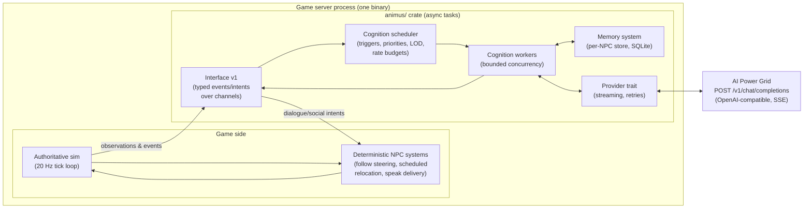
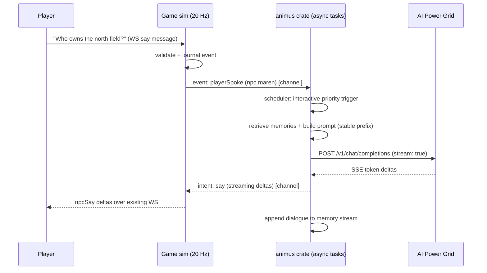
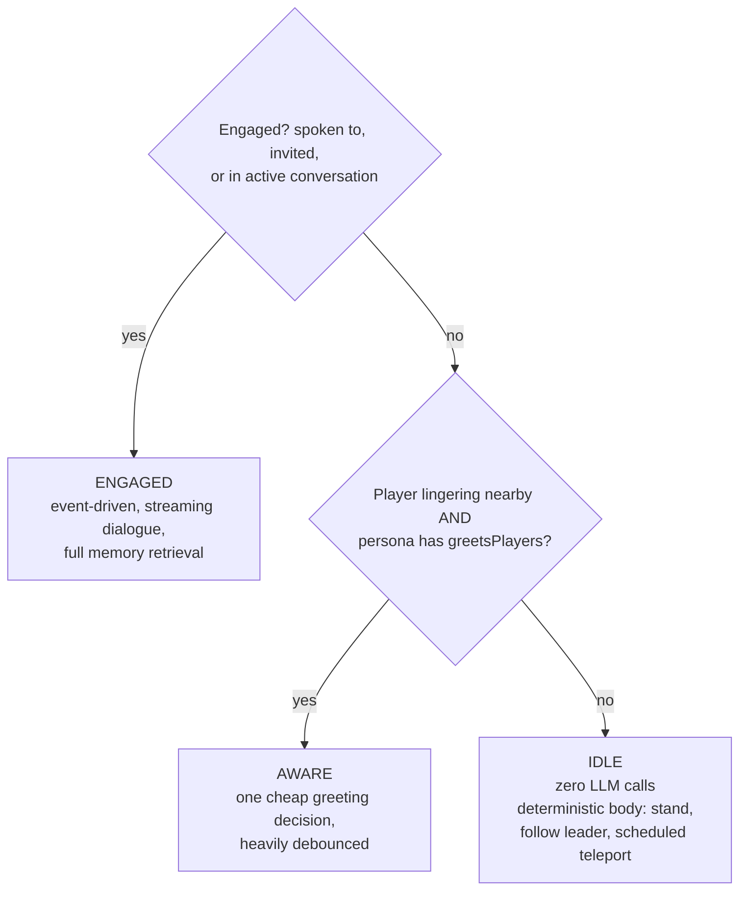
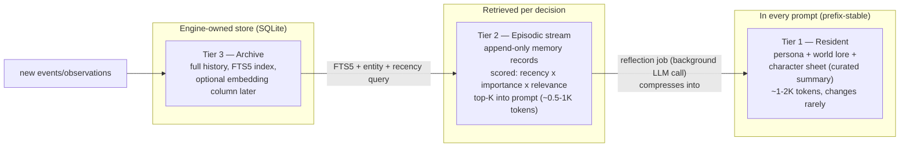

# Animus — LLM NPC Engine Design

> Working name **Animus** (placeholder — rename freely). Status: **revision 4, phases 1–4 implemented**.
> Implementation status (2026-07-11): build phases 1–4 (§11) are shipped — NPC bodies with
> follow/party/scheduled relocation, hardened `say`/`npcSay` speech plumbing, the `animus/`
> workspace crate with interface v1 + MockProvider, and live cognition via the AI Power Grid
> provider with degrade-to-canned. Phases 5–6 (SQLite/FTS5 memory, reflection) remain future
> work; a bounded in-process per-NPC transcript covers multi-turn coherence meanwhile.
> Reproduction steps: README § "Talk to an NPC". Smokes: `npc-render`, `npc-chat`,
> `npc-chat-mock`, `cognition-fallback`.
> Host game: Duskfell PoC. The engine is a **game-agnostic workspace crate inside this repo**, embedded in the game server process. Portability to other games is preserved by a strict data-driven interface (entities/events/verbs, personas as content), not by process or repo separation; a network wrapper for non-Rust games is a designed-for later option (§10), not v1 infrastructure.

Inspired by *Generative Agents: Interactive Simulacra of Human Behavior* (Park et al., Stanford 2023) — memory stream, reflection — updated for the 2026 LLM landscape, and **deliberately narrower than the paper**: in v1 the engine drives dialogue and social decisions only. NPC movement is deterministic game logic. The paper's autonomous daily behavior is a designed-for later extension, not a v1 feature.

---

## 1. Goals & non-goals

**Goals**

- NPCs with persistent memory, personality, and real-time dialogue, driven by an LLM.
- **Dialogue-first scope (v1):** the engine decides what an NPC *says* and small social choices (accept/decline a party invite). It never decides where an NPC walks.
- **Game-agnostic core**: the engine crate knows *entities, events, verbs, and places* — never *groves, deeds, or Field Forges*. No Duskfell nouns inside the crate; this is enforced by the crate boundary and review.
- **The sim never blocks on the LLM.** The engine runs as async tasks on the game's runtime, off the 20 Hz tick path — the same pattern as the existing settlement worker.
- The game stays authoritative. The engine only ever *suggests* intents; the game validates and executes them.
- **Extension without redesign:** later capabilities (`wander`, daily plans, NPC↔NPC conversation, a network wrapper for non-Rust games) slot in by registering new verbs and flipping config — no interface redesign. See §10.
- NPCs degrade gracefully: if the LLM is slow, rate-limited, or down, NPCs keep doing their deterministic behavior and fall back to canned dialogue.
- Cost and rate limits are first-class design inputs: engagement-scoped scheduling, request budgets, and stable-prefix prompts are core features, not afterthoughts.
- There will be a per npc store for their memories but also a second shared store that contains world info, general lore, etc that acts as general knowledge base all NPCS should be able to access.

- **Non-goals**

- Not a movement/behavior AI. NPCs are **mostly stationary**; they move only by deterministic game systems: follow-the-party-leader steering, and scheduled relocations authored as game content. The LLM emits no movement verbs in v1.
- Not a game AI middleware for pathfinding/steering/combat micro — ever.
- Not a general agent framework. It is opinionated about one shape: many long-lived characters in a running world.
- No player-facing LLM authority: the LLM never mutates world state directly.

---

## 2. Big picture: engine as an embedded crate

**Decision: embedded crate.** `animus/` is a workspace member with a strict interface: events in, intents out, verbs and personas as data, LLM access behind a provider trait. The game server owns the process, the deploy, and the config; the crate owns cognition, memory, and provider I/O.




**What we consciously gave up vs. the sidecar** (recorded in D1/D14):

- **Key custody:** the AI Power Grid API key now lives in the game server's environment. Blast radius is inference spend and prompt access — not player assets or signing authority — and per-NPC/per-world budgets (§6) are the guardrail. This is weaker isolation than the signer-key rule and is accepted deliberately.
- **Crash isolation:** an engine bug can take down the shard, not just NPC cognition. Mitigation: engine tasks are panic-contained (join-handle supervision, same as settlement), and the engine can be disabled by config leaving NPCs fully deterministic.
- **Independent restart:** bouncing the engine without dropping players is no longer possible; degrade-to-canned makes this mostly moot.

**Operational note (Duskfell):** the engine makes the game server's **first real outbound network calls and holds its first external secret**. `deployment-preflight` and the public-deployment guardrails gain checks for the provider base URL and key presence; `/readyz` treats provider unreachability as a *degraded* signal (NPCs go canned-dialogue), never hard-down — same posture as settlement backpressure. Engine health, token/request spend, queue depth, and degraded-NPC counts join the shard's existing Prometheus surface (§6).

---

## 3. The game ↔ engine interface (crate API v1)

The "engine" property lives or dies here. **Verb registration is also the extension mechanism** — every future capability arrives as a new registered verb. The interface has four parts. Examples below are shown as JSON for readability; in-process they are `serde`-derived Rust types passed over channels, which makes a future network wrapper a serialization exercise, not a redesign.

### 3.1 World registration (game → engine, at startup)

The game declares its vocabulary. The engine has **no built-in nouns or verbs**.

```jsonc
{
  "worldId": "duskfell-shard-1",
  "verbs": [
    // v1: dialogue + social decisions only. No movement verbs.
    { "name": "say",          "params": { "targetId": "string?", "text": "string" } },
    { "name": "acceptParty",  "params": { "inviteId": "string" } },
    { "name": "declineParty", "params": { "inviteId": "string", "text": "string?" } },
    { "name": "leaveParty",   "params": { "text": "string?" } }
    // later, when the game implements the executors (§10):
    // { "name": "goTo", ... }, { "name": "wander", ... }, { "name": "converseWith", ... }
  ],
  "lore": "One paragraph of world context injected into every prompt (prefix-stable).",
  "placeGlossary": { "titleOffice": "Where deeds are claimed", "fieldForge": "Crafting station" }
}
```

The verb list compiles into a **JSON Schema the engine enforces on every LLM response** (§6): the model is prompted to answer in that shape, the engine validates strictly, retries once on mismatch, and falls back to canned dialogue rather than ever surfacing a malformed intent. Adding an NPC capability = the game adds a verb (and the deterministic code to execute it); no engine changes.

### 3.2 NPC registration (personas as data)

Each NPC is a data file the game (or a designer) ships — the plug-and-play content unit:

```jsonc
// personas/maren-the-registrar.json
{
  "id": "npc.maren",
  "name": "Maren",
  "role": "Title Office registrar",
  "persona": "Meticulous, dry-witted, proud of the ledger. Distrusts adventurers who claim deeds without reading them.",
  "drives": ["keep the ledger accurate", "gossip about land claims"],
  "homePlace": "titleOffice",
  "partyPolicy": "reluctant",          // hint the LLM sees when deciding acceptParty
  "greetsPlayers": false,              // opts this NPC into the AWARE greeting tier (D17)
  "cognition": { "tier": "standard", "canned": ["The ledger doesn't read itself.", "Mm."] }
}
```

Persona files are **JSON** (D16) and go through the same content discipline as `world.json`: schema-validated before boot, size-capped, hashed into the admin-visible content manifest.

### 3.3 Observations & events (game → engine, streaming)

The game pushes what each NPC can perceive. **The game side synthesizes most of these from live sim state** — proximity from the spatial index (Duskfell's `INTEREST_RADIUS` machinery), party membership from party state, speech from the chat path. The append-only journal *supplements* this with gameplay events worth remembering (a deed claimed at Maren's desk), but the journal alone is not a perception feed: it records gameplay-affecting events, not "a player walked up to me."

```jsonc
{ "kind": "playerSpoke", "npcId": "npc.maren", "at": "2026-07-10T12:31:04Z",
  "data": { "playerId": "p.123", "name": "Wayfarer", "text": "Who owns the north field?" } }

{ "kind": "partyInvite", "npcId": "npc.maren", "at": "2026-07-10T12:32:10Z",
  "data": { "inviteId": "inv-77", "playerId": "p.123", "name": "Wayfarer" } }

{ "kind": "observation", "npcId": "npc.maren",
  "snapshot": { "place": "titleOffice", "nearby": [ ... ], "selfState": { "party": null } } }
```

### 3.4 Intents (engine → game)

```jsonc
{ "npcId": "npc.maren", "decisionId": "d-8891",
  "verb": "say", "params": { "targetId": "p.123", "text": "The north field? Check the ledger…" },
  "streaming": true }   // say-intents may stream text deltas as follow-up messages
```

The game **validates every intent** against its own rules before executing (authority boundary: range checks, party rules, text length caps) — this holds even though the engine already schema-validated the shape. Invalid intents are reported back as an event (`intentRejected`) so the NPC can learn/replan.



---

## 4. Cognition: triggers, scheduling, level-of-detail

NPCs think on **triggers, never on ticks** — and with movement out of scope, the trigger set is small and conversation-shaped. The scheduler is the cost *and rate-limit* governor (§6).

| Trigger | Priority | Latency target |
|---|---|---|
| Player speaks to NPC | interactive | first token < 2 s (streamed); hard timeout → canned line |
| Party invite received | interactive | < 5 s |
| Player lingers near NPC (greeting; only personas with `greetsPlayers: true`) | high (debounced) | < 10 s |
| Intent rejected / party event (kicked, leader left) | medium | < 30 s |
| Reflection (compress recent memories into character sheet) | background | minutes; runs in quiet-period lane |

Latency targets are *targets*: AI Power Grid is a community GPU network whose latency varies with worker availability and Den priority (§6). Every interactive job carries a hard timeout; on expiry the NPC delivers a persona-appropriate canned line and the job is dropped, not queued.

**Cognition level-of-detail (LOD)** — with dialogue-first scope this collapses to something very cheap:



**Cost model: spend scales with conversations, not with NPC count.** An NPC nobody is talking to costs zero tokens — not "cheap," zero — because its body is pure deterministic game logic. Baseline spend for a shard full of idle NPCs is one reflection job per NPC per game-day, nothing else.

Worker pool: bounded concurrency (semaphore), bounded queue, **drop-on-full for non-interactive jobs** (a skipped greeting is harmless). Interactive dialogue jobs get the reserved lane. Contrast with Duskfell's settlement outbox, where jobs must never be lost: thoughts are cheap to regenerate, so no durable outbox for cognition jobs.

---

## 5. Memory — the RAG question

### 5.1 What changed since 2024 (and since the paper)

The 2023 paper used a memory stream retrieved by **recency × importance × relevance**, with relevance = *embedding similarity* (vector RAG). That was the right call in 2023. Since then:

1. **Long context changed the economics**: a stable, curated prompt prefix (persona, world lore, "character sheet") is small next to modern context windows, so the important stuff can stay resident in every call instead of being retrieved. Prefix-stable layout also means any provider-side caching or KV reuse applies automatically where available (§6).
2. **Agentic / model-curated memory** became the dominant pattern for agents (memory tools, MemGPT/Letta lineage): instead of embedding-searching a raw log, the *model itself* periodically compresses experience into structured notes it later re-reads. Reflection in the paper was already this idea — it's now the centerpiece rather than a bolt-on.
3. **Vector DBs lost their default status.** For corpora at NPC scale (10²–10⁴ memories per character), lexical retrieval (BM25/full-text search) plus entity and recency filters performs comparably to embeddings, with far less infrastructure and better *precision* (embedding search happily returns "semantically similar but situationally irrelevant" memories). Embeddings still win at large scale or for fuzzy semantic recall — they're an *optimization*, not the architecture.

**Bottom line: keep RAG-the-concept (you must retrieve — an NPC's life history can't ride along in every prompt at any price), drop vector-DB-the-default.** Retrieval scoring stays exactly the paper's `recency × importance × relevance` — only the relevance term changes from embedding similarity to full-text/entity match, with an upgrade path.

### 5.2 Three memory tiers



- **Tier 1 — Resident (curated).** The NPC's "character sheet": persona (static) + a model-maintained summary of who they are *now* — relationships, grudges, goals, notable recent history ("traveled three days in Wayfarer's party"). Updated only by **reflection** jobs, so it's byte-stable between reflections.
- **Tier 2 — Episodic (retrieved).** Recent raw memories relevant to the current trigger. Retrieval query = entities in the current observation + trigger keywords; scored by `recency_decay × importance × fts_rank`.
- **Tier 3 — Archive (stored).** Everything, forever (bounded by retention policy). One **SQLite file per world** — queryable, transactional, single-file portable, and FTS5 gives lexical relevance for free. Importance is scored at write time (cheap heuristic: event kind weight + involves-a-player bonus; optionally LLM-scored for dialogue).

**Upgrade path, not up-front cost:** the retrieval interface is `fn retrieve(npc, query, k) -> Vec<MemoryRecord>`. If a game ever needs semantic recall at scale, add an embeddings column and blend it into the same score — zero API change, no separate vector DB service.

**In Duskfell specifically:** the game side feeds the engine synthesized perception events (§3.3) plus interest-filtered journal events. The engine's SQLite store is separate from and additive to the game's `var/journal.jsonl` (game owns world truth; engine owns subjective NPC memory — which may be *wrong*, and that's a feature: NPCs can misremember).

---

## 6. LLM provider layer

Isolated behind a trait so deployments can swap backends; first-party target is **AI Power Grid** (`https://api.aipowergrid.io`), a community GPU network with an OpenAI-compatible API. Integration is raw HTTPS via `reqwest` + `serde` (crates.io-only; note `reqwest` brings a sizeable dependency tree, so the addition must pass `supply-chain-smoke`).

| Concern | Decision |
|---|---|
| Endpoint | `POST /v1/chat/completions`, `Authorization: Bearer <key>` (keys from `console.aipowergrid.io`). AIPG also exposes an Anthropic-compatible `/v1/messages`; we standardize on the OpenAI shape as the most portable across backends |
| Model | **Dynamic** — the grid's models come and go with workers; discover via `GET /v1/models` (empty list ⇒ no workers ⇒ requests 503). Model name is config, not code (e.g. `gpt-oss-120b`); see O1 |
| Streaming | SSE (`"stream": true`), token deltas via `choices[0].delta.content`, terminated by `data: [DONE]`; deltas forwarded to the game as streaming intent messages |
| Intent format | **Engine-enforced JSON**: AIPG does not document structured outputs or tool calling, so the verb schema (§3.1) is enforced by prompting for JSON + strict engine-side validation + one bounded retry on mismatch → canned fallback. The game's authority-boundary validation (§3.4) backstops everything |
| Rate limits | **30 requests/minute per IP** on chat — a hard shaping constraint for a whole shard. The scheduler owns a global request budget: interactive dialogue gets the reserved share, greetings/reflection consume leftovers, excess non-interactive jobs drop. Sustained saturation ⇒ demote to canned (see O2 for capacity options) |
| Queue priority | AIPG's **Den** credit system: paid credits buy faster service; free tier has a daily quota. Tier choice and Den budget are deployment config (O2) |
| Slow lane | No batch-discount API documented; reflection jobs run in the scheduler's quiet-period lane under the same request budget |
| Retries/backoff | Exponential backoff on 429/5xx/503; 503-with-empty-models means *no workers on the grid* — treat as provider-down and degrade to canned, don't hammer |

**Prompt layout (stable-prefix discipline)** — order matters:

```
[ system: engine framing + intent JSON schema from registered verbs ]  ── stable per world
[ system: world lore + place glossary ]                                ── stable per world
[ system: persona + character sheet (Tier 1) ]                         ── stable per NPC, changes only on reflection
[ user: retrieved memories (Tier 2) + current observation + trigger ]  ── volatile
```

Never put timestamps, tick numbers, or random IDs in the stable segments. AIPG doesn't document server-side prompt caching, so unlike revision 3 this layout claims no cache discount — it's kept because it costs nothing, makes decision traces diffable, lets grid workers reuse KV state where their backends support it, and turns into an automatic discount on any future provider that does cache prefixes.

**Budgets & metering:** per-NPC and per-world token *and request* budgets tracked from `usage` on every response; when a budget trips, the scheduler demotes to canned dialogue rather than hard-failing. All exposed as Prometheus-style metrics (`animus_tokens_total`, `animus_requests_total{tier=}`, `animus_request_budget_remaining`, `animus_queue_depth`, `animus_degraded_npcs`) on the shard's existing `/metrics` surface.

---

## 7. Game-side prerequisites (Duskfell)

The engine assumes game capabilities that do not exist in the PoC yet. These are ordinary game features, worth building even if the engine never shipped, and they land as Phases 1–2 (§9):

1. **NPC bodies in the sim.** New entities with `Position` (+ `Velocity` only while following). The existing movers loop (`sim.rs`) already moves anything with `Position + Velocity`, so following reuses all terrain/blocker/speed rules. New systems: **follow steering** (write velocity toward party leader when beyond follow distance; ~15 lines) and **scheduled relocation** (authored game content: "at 18:00 world time, Maren is at the square" — validated destination, spatial-index update, journaled `npcRelocated` event). NPCs join the spatial index so proximity queries and interest filtering include them.
2. **NPCs on the wire as their own list.** `npcs: Vec<NpcSnapshot>` in `WorldSnapshot`, separate from `players` (no name-uniqueness rules, different client affordances like a talk prompt). Interest-filtered like everything else. Protocol change → touches `client-protocol-smoke` and the renderer.
3. **Player speech — the first free-text input beyond rename.** New `say` client message, hardened exactly like rename: byte-bounded, rate-budgeted per socket, rejection-counted in `/metrics`, journaled. **NPC-targeted only** (D18): the message requires a valid in-range NPC target and is rejected otherwise — player↔player chat is a separate future feature with its own moderation/abuse scope, and nothing here should be mistaken for it. New `npcSay` server frames (streamed deltas) with their own byte/rate bounds — dialogue rides event-style frames, not snapshots, so `MAX_SNAPSHOT_BYTES` is untouched but the new frames need equivalent caps.
4. **Party state.** Server-owned membership (invite → NPC decision → joined), validated interacts, journaled transitions. Party *rules* (size, who invites, combat implications) are game design outside this doc; the engine only consumes `partyInvite`/`partyJoined`/`partyLeft` events and emits `acceptParty`/`declineParty`/`leaveParty` intents.
5. **Smokes**, Duskfell-style: `npc-render-smoke` (bodies appear, follow, relocate), `npc-chat-smoke` (say → canned reply end-to-end via MockProvider, no network), `cognition-fallback-smoke` (no API key / provider unreachable / empty model list — NPCs keep following and answer canned).

---

## 8. Safety & robustness

- **Prompt injection via player chat** is the #1 threat: player text goes into NPC prompts. Mitigations: player content always inside a clearly delimited untrusted block; system prompt instructs the NPC to treat it as in-world speech only; intents constrained by engine-side schema validation (worst case: NPC *says* something odd — a malformed or undeclared verb never survives validation, and the game re-validates besides); the game-side `say` path is bounded and rate-limited before the engine ever sees it (§7.3); optional profanity/abuse filter hook at the interface.
- **Two-layer intent validation.** Without provider-enforced structured outputs (§6), the engine's strict schema validation is the first gate and the game's authority-boundary validation is the second. A model that returns prose instead of JSON, or JSON with an undeclared verb, produces a canned line — never a mutated world.
- **Key custody:** the AI Power Grid key lives in the game server environment (accepted tradeoff of embedding, D14). It is excluded from `/admin/runtime`, logs, and decision traces; per-world budgets cap the damage of a leak; rotation is a config change.
- **Authority boundary:** every intent re-validated by the game (range checks, party rules, text caps). `intentRejected` events feed back into memory so NPCs adapt instead of looping.
- **Determinism for CI:** a `MockProvider` (canned/scripted responses) behind the provider trait — enables the smokes in §7.5 with zero network.
- **Decision traces:** every cognition run journaled (trigger, retrieved memory IDs, prompt hash, intent, token usage) to an append-only engine log → answers "why did Maren refuse the party invite," enables replay.
- **Fail-degraded, not fail-closed:** provider unreachable, rate-limited, or worker-starved → NPCs keep deterministic bodies + canned lines; `/readyz` reports degraded NPC cognition without failing shard readiness (same posture as settlement backpressure). Preflight and public-deployment guardrails gain provider-boundary checks (base URL config, key present, budgets configured).

---

## 9. Decision log

### Decided

| # | Decision | Choice | Why |
|---|---|---|---|
| D1 | Packaging | **Embedded workspace crate (`animus/`), async tasks on the game runtime, typed channel interface** — reverses rev 1–3's sidecar | Sidecar's main beneficiary (non-Rust second game) is speculative; non-blocking never required process separation (settlement-worker precedent); network wrapper remains a cheap later option (§10) |
| D2 | Engine language & boundary | Rust crate; game-agnostic — no Duskfell nouns inside; verbs/personas as data | Preserves plug-and-play design without protocol infrastructure |
| D3 | Memory | Tiered: curated sheet + episodic stream + SQLite/FTS5 archive; **no vector DB v1** | 2026 best practice at NPC scale; embeddings = later optimization behind same interface |
| D4 | Retrieval scoring | recency × importance × FTS relevance (paper's formula, lexical relevance) | Precision + zero extra infra |
| D5 | Intent safety | Verb schema enforced by **engine-side strict validation + one retry**, backstopped by game authority validation | AIPG documents no structured outputs; two gates preserve the guarantee where it matters |
| D6 | Cost & rate model | Trigger-driven + engagement LOD (IDLE/AWARE/ENGAGED) + global request budget shaped to provider limits | Idle NPCs cost zero tokens; spend scales with conversations; 30 req/min/IP is a scheduler input, not a surprise |
| D7 | Failure mode | Degrade to canned dialogue on timeout/429/503/empty-models; deterministic bodies unaffected; drop stale non-interactive jobs | NPCs never freeze because a provider did |
| D8 | Personas | Data files shipped by the game, schema-validated at boot like all Duskfell content | Designers add NPCs without code |
| D9 | LLM provider | **AI Power Grid**, OpenAI-compatible `/v1/chat/completions`, SSE streaming; model is config discovered via `/v1/models`; provider trait retained for other backends | User decision; OpenAI shape is the most portable; grid models are dynamic by nature |
| D10 | NPC movement | Deterministic game logic only: static by default, follow-party steering, scheduled relocation. No LLM movement verbs in v1 | Movement quality/cost/latency all improve; engine is dialogue-first; `wander`/plans are additive later (§10) |
| D11 | NPC wire representation | Own `npcs` list in the snapshot, separate from `players` | Client affordances differ; no name-uniqueness or session semantics |
| D12 | Player speech ingress | New bounded `say` client message hardened like rename (bytes, rate, rejection counters, journal) | First free-text player input; must inherit existing input discipline |
| D13 | Dialogue egress | Event-style `npcSay` frames with own byte/rate caps, outside snapshot cadence | Streaming text doesn't fit snapshot shape; snapshot caps untouched |
| D14 | API key custody | Game server environment (consequence of D1); excluded from admin/logs/traces; per-world budgets as guardrail | Accepted tradeoff vs. sidecar isolation — blast radius is spend, not assets or signing |
| D15 | Party mechanics | Game-owned state and rules; engine only sees invite events and emits accept/decline/leave intents | Authority boundary; party design stays game design |
| D16 | Persona file format | JSON | Reuses the existing schema-validation/caps/manifest discipline verbatim; no new dependency |
| D17 | Proactive greetings | Supported in v1 via per-persona `greetsPlayers` flag, default `false`; which NPCs get it is a later content decision | Spend and injection surface are opted into per character, not globally |
| D18 | `say` scope | NPC-targeted only; requires a valid in-range NPC target | Player↔player chat has a much larger moderation/abuse scope and is out of this design entirely |
| D19 | Where the engine lives | Permanent workspace subdirectory of duskfell-poc; **no separate repo, now or later** | Shared CI, supply-chain, and smoke gates; portability is proven by the interface, not by repo separation |
| D20 | Non-Rust host games | Served by a future thin network wrapper around interface v1 (§10), not by v1 architecture | Defers the expensive part until it has a real user; transport/multi-tenant questions dissolve with it |

### Open questions (need your call)

| # | Question | Options / lean |
|---|---|---|
| O1 | Grid model choice & quality bar | Which AIPG model is the dialogue default (`gpt-oss-120b`?, whatever the grid reliably staffs?), and what's the minimum acceptable quality/latency before an NPC should prefer a canned line. Needs a hands-on eval against real persona prompts — grid model availability varies |
| O2 | Capacity & tier | Free tier (daily quota) vs paid (Den priority, unlimited) — and whether 30 req/min/IP is livable for a busy shard or Duskfell should run its own grid worker / request a raised limit. Lean: start free for development, decide before any shared demo |

---

## 10. Extension path: capabilities we deliberately deferred

The promise of D2/D5/D10 is that these arrive **without touching the engine's architecture** — each is: game registers a verb + implements its deterministic executor, engine flips a scheduler config. Listed with what they'd actually take:

| Extension | Game adds | Engine adds | Notes |
|---|---|---|---|
| `goTo` / `wander` | Goal-seeking movement executor (steer-toward-target exists from follow; wander = pick valid nearby point) + register verbs | Enable ambient-heartbeat trigger for NPCs with movement verbs | This is where an ambient cognition tier returns, scoped to worlds that want it |
| Daily plans | Nothing beyond `goTo` | Quiet-lane planning job generating a plan; deterministic playback of plan steps | Off-screen NPCs still cost zero — plans play back deterministically |
| NPC↔NPC conversation (`converseWith`) | Deliver `say` between NPCs; render nearby | Conversation pairing scheduler + strict per-pair token budget behind a config flag | The paper's parties/elections emerged from this; doubles spend where enabled |
| Overheard dialogue as memory | Forward nearby speech events to bystander NPCs | Nothing (it's just events) | Cheap memory writes, no extra LLM calls |
| Emotes / mood | Register `emote` verb + client render | Nothing | Trivial once dialogue works |
| **Network wrapper (sidecar mode)** | Nothing | Thin WS/JSON server serializing interface v1; adapter clients (~200 loc/language) | Revives the rev-3 sidecar as a *deployment option* if a non-Rust host game becomes real (D20) |

Ordering constraint: `goTo` precedes daily plans; everything else is independent.

---

## 11. Build phases

Each phase independently smoke-testable, Duskfell-style. Phases 1–2 are pure game features with standalone value (scripted NPCs); the engine enters at Phase 3.

1. **NPC bodies (game-side only).** NPC entities from content, `npcs` snapshot list, client rendering, follow-steering system, scheduled relocation, party join/leave state, spatial-index membership. Smoke: `npc-render-smoke`. No engine, no LLM.
2. **Speech plumbing (game-side only).** Hardened `say` client message, `npcSay` streamed frames, canned-responder stub behind a trait. Smokes: `npc-chat-smoke`, input-hardening checks. Still no engine.
3. **Engine crate skeleton + interface v1.** `animus/` workspace member boots with the game, world/persona registration, MockProvider, one NPC driven end-to-end via scripted engine decisions. CI-safe, zero network.
4. **Live cognition.** AI Power Grid provider (OpenAI-compatible, SSE streaming), engine-side intent validation + retry, request/token budgets shaped to grid rate limits, `/v1/models` health probe, metrics, degrade-to-canned. Smoke: `cognition-fallback-smoke`.
5. **Memory v1.** SQLite + FTS5 stream, write-time importance, retrieval into prompts. Boot replay.
6. **Reflection.** Quiet-lane reflection jobs updating the character sheet under the same request budget.

*(Former Phase 7 — Python adapter / portability proof — moved to §10 as the network-wrapper extension; it now ships only when a non-Rust host game actually exists.)*
