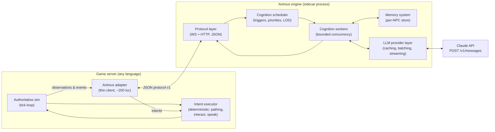
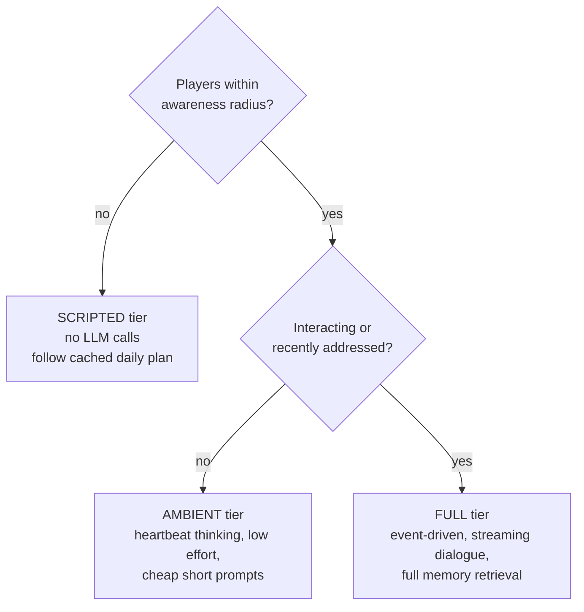

# Animus — LLM NPC Engine Design

> Working name **Animus** (placeholder — rename freely). Status: **draft for review**.
> First host game: Duskfell PoC. Design goal: extractable, plug-and-play engine usable by other games, including non-Rust (e.g. Python) projects.

Inspired by *Generative Agents: Interactive Simulacra of Human Behavior* (Park et al., Stanford 2023) — memory stream, reflection, hierarchical planning — updated for the 2026 LLM landscape (long context, prompt caching, structured outputs, agentic memory).

---

## 1. Goals & non-goals

**Goals**

- NPCs with persistent memory, believable daily behavior, and real-time dialogue, driven by an LLM.
- **Game-agnostic core**: the engine knows *entities, events, verbs, and places* — never *groves, deeds, or Field Forges*.
- **Plug-and-play**: a new game integrates by speaking a small protocol and shipping persona/content files, not by linking Rust code.
- The game server stays authoritative. The engine only ever *suggests* intents; the game validates and executes them.
- NPCs degrade gracefully: if the LLM is slow, rate-limited, or down, NPCs keep acting on their last plan or scripted ambience.
- Cost is a first-class design input: caching, batching, and attention-based scheduling are core features, not afterthoughts.

**Non-goals**

- Not a game AI middleware for pathfinding/steering/combat micro — the *game* executes movement; the engine decides *what to do*, not *how to walk*.
- Not a general agent framework. It is opinionated about one shape: many long-lived characters in a running world.
- No player-facing LLM authority: the LLM never mutates world state directly.

---

## 2. Big picture: engine as a sidecar

The single most important packaging decision. Three options considered:

| Option | Plug-and-play for a Python game? | Notes |
|---|---|---|
| Rust library crate | ❌ needs FFI bindings per language | Tightest integration with Duskfell, worst portability |
| **Sidecar service, JSON protocol** ✅ | ✅ any language speaks JSON | One process per game world (or shared); thin client per language |
| Python engine library | ❌ for the Rust game | Inverts the problem; also weaker deployment story |

**Decision: sidecar service.** The engine runs as its own process next to the game server. Integration surface is a versioned JSON protocol (WebSocket for the event/intent stream + HTTP for admin/config). A game adapter is a thin client — a few hundred lines in any language. The engine core is Rust (single static binary, fits Duskfell's supply-chain and deployment discipline), but **no game ever links against it**, so the implementation language is invisible to host games.



**Why this wins:** the Duskfell server keeps its 20 Hz tick and never blocks on the LLM (same principle as the existing async settlement worker); your Python game gets the identical engine by writing one small adapter; the engine can be developed, versioned, tested, and even hosted independently of any game.

---

## 3. The game ↔ engine contract (protocol v1)

The whole "engine" property lives or dies here. The contract has four parts:

### 3.1 World registration (game → engine, at startup)

The game declares its vocabulary. The engine has **no built-in nouns or verbs**.

```jsonc
{
  "type": "registerWorld",
  "worldId": "duskfell-shard-1",
  "verbs": [
    { "name": "goTo",    "params": { "x": "number", "y": "number" } },
    { "name": "interact", "params": { "targetId": "string" } },
    { "name": "say",     "params": { "targetId": "string?", "text": "string" } },
    { "name": "wander",  "params": {} },
    { "name": "idle",    "params": { "seconds": "number" } }
  ],
  "lore": "One paragraph of world context injected into every prompt (cache-stable).",
  "placeGlossary": { "titleOffice": "Where deeds are claimed", "fieldForge": "Crafting station" }
}
```

The verb list becomes the **JSON Schema for structured outputs** — the LLM can only ever emit intents the game declared. Adding an NPC capability = the game adds a verb; no engine changes.

### 3.2 NPC registration (personas as data)

Each NPC is a data file the game (or a designer) ships — this is the plug-and-play content unit:

```yaml
# personas/maren-the-registrar.yaml
id: npc.maren
name: Maren
role: Title Office registrar
persona: |
  Meticulous, dry-witted, proud of the ledger. Distrusts adventurers
  who claim deeds without reading them.
drives: [keep the ledger accurate, gossip about land claims]
homePlace: titleOffice
schedule_hint: "works 8-18, walks the square at dusk"
cognition:
  tier: full          # full | ambient | scripted
  heartbeat_seconds: 45
```

### 3.3 Observations & events (game → engine, streaming)

The game pushes what each NPC can perceive — already interest-filtered by the game (Duskfell's `INTEREST_RADIUS` machinery does this for free):

```jsonc
{ "type": "event", "npcId": "npc.maren", "at": "2026-07-08T12:31:04Z",
  "kind": "playerSpoke", "data": { "playerId": "p.123", "name": "Wayfarer", "text": "Who owns the north field?" } }

{ "type": "observation", "npcId": "npc.maren",
  "snapshot": { "place": "titleOffice", "nearby": [ ... ], "selfState": { ... } } }
```

### 3.4 Intents (engine → game)

```jsonc
{ "type": "intent", "npcId": "npc.maren", "decisionId": "d-8891",
  "verb": "say", "params": { "targetId": "p.123", "text": "The north field? Check the ledger…" },
  "streaming": true }   // say-intents may stream text deltas in follow-up frames
```

The game **validates every intent** against its own rules before executing (authority boundary). Invalid intents are reported back as an event (`intentRejected`) so the NPC can learn/replan.

```mermaid
sequenceDiagram
    participant P as Player
    participant G as Game server (sim, 20 Hz)
    participant E as Animus engine
    participant C as Claude API

    P->>G: "Who owns the north field?" (WS say message)
    G->>G: validate + journal event
    G->>E: event: playerSpoke (npc.maren)
    E->>E: scheduler: high-priority trigger
    E->>E: retrieve memories + build prompt (cached prefix)
    E->>C: POST /v1/messages (streaming, structured intent)
    C-->>E: text deltas
    E-->>G: intent: say (streaming deltas)
    G-->>P: npcSay deltas over existing WS
    E->>E: append dialogue to memory stream
    Note over G,E: sim never blocked; NPC body kept idling deterministically
```

---

## 4. Cognition: triggers, scheduling, level-of-detail

NPCs think on **triggers, never on ticks**. The scheduler is the cost governor.

| Trigger | Priority | Typical latency budget |
|---|---|---|
| Player speaks to NPC | interactive | first token < 2 s (streamed) |
| Player enters/leaves NPC's awareness | high (debounced) | < 10 s |
| Plan step completed / failed / intent rejected | medium | < 30 s |
| Ambient heartbeat (players nearby) | low | 30–60 s cadence |
| Reflection (compress recent memories) | background | minutes |
| Daily planning / offline world evolution | batch | hours (Batches API, 50% cost) |

**Cognition level-of-detail (LOD)** — the biggest cost lever:



Off-screen NPCs cost **zero tokens** — they follow their (batch-generated) daily plan deterministically. This is the luxury the Stanford paper didn't have: they had no real players, so everyone was always "on screen." You do, so unobserved NPCs can be cheap.

Worker pool: bounded concurrency (semaphore), bounded queue, **drop-on-full for thoughts** (a skipped think cycle is harmless — the NPC continues its current plan). Contrast with Duskfell's settlement outbox, where jobs must never be lost: thoughts are cheap to regenerate, so no durable outbox for cognition jobs.

---

## 5. Memory — the RAG question

### 5.1 What changed since 2024 (and since the paper)

The 2023 paper used a memory stream retrieved by **recency × importance × relevance**, with relevance = *embedding similarity* (vector RAG). That was the right call in 2023. Since then:

1. **Long context + prompt caching** changed the economics: a stable, curated prompt prefix (persona, world lore, "character sheet") is nearly free to re-send on every call (~0.1× input price when cached). You no longer need to retrieve *everything* — you keep the important stuff resident.
2. **Agentic / model-curated memory** became the dominant pattern for agents (memory tools, MemGPT/Letta lineage): instead of embedding-searching a raw log, the *model itself* periodically compresses experience into structured notes it later re-reads. Reflection in the paper was already this idea — it's now the centerpiece rather than a bolt-on.
3. **Vector DBs lost their default status.** For corpora at NPC scale (10²–10⁴ memories per character), lexical retrieval (BM25/full-text search) plus entity and recency filters performs comparably to embeddings, with far less infrastructure and better *precision* (embedding search happily returns "semantically similar but situationally irrelevant" memories). Embeddings still win at large scale or for fuzzy semantic recall — they're an *optimization*, not the architecture.

**Bottom line: keep RAG-the-concept (you must retrieve — an NPC's life history can't ride along in every prompt at any price), drop vector-DB-the-default.** Retrieval scoring stays exactly the paper's `recency × importance × relevance` — only the relevance term changes from embedding similarity to full-text/entity match, with an upgrade path.

### 5.2 Three memory tiers


- **Tier 1 — Resident (curated).** The NPC's "character sheet": persona (static) + a model-maintained summary of who they are *now* — relationships, grudges, goals, notable recent history. Updated only by **reflection** jobs, so it's byte-stable between reflections → sits before the prompt-cache breakpoint and caches across every think.
- **Tier 2 — Episodic (retrieved).** Recent raw memories relevant to the current trigger. Retrieval query = entities in the current observation + trigger keywords; scored by `recency_decay × importance × fts_rank`.
- **Tier 3 — Archive (stored).** Everything, forever (bounded by retention policy). One **SQLite file per world** — queryable, transactional, single-file portable, and FTS5 gives lexical relevance for free. Importance is scored at write time (cheap heuristic: event kind weight + involves-a-player bonus; optionally LLM-scored for dialogue).

**Upgrade path, not up-front cost:** the retrieval interface is `fn retrieve(npc, query, k) -> Vec<MemoryRecord>`. If a game ever needs semantic recall at scale, add an embeddings column and blend it into the same score — zero API change, no separate vector DB service.

**In Duskfell specifically:** the game's append-only journal is already the observation firehose — the adapter forwards interest-filtered journal events as engine events. The engine's SQLite store is separate from and additive to the game's `var/journal.jsonl` (game owns world truth; engine owns subjective NPC memory — which may be *wrong*, and that's a feature: NPCs can misremember).

---

## 6. LLM provider layer

Isolated behind a trait so games/deployments can pick models per tier; first-party target is the Claude Messages API via raw HTTPS (no official Rust SDK; `reqwest` + `serde`, crates.io-only, which keeps Duskfell's supply-chain gate green).

| Concern | Decision |
|---|---|
| Default model | `claude-opus-4-8` for FULL-tier cognition & dialogue |
| Tiering (optional, config) | cheaper model allowed for AMBIENT heartbeats — explicit config choice, not a silent default |
| Thinking | `thinking: {"type": "adaptive"}`; `output_config.effort` = `low` for routine intents, `high` for reflection/planning |
| Intent format | **Structured outputs** (`output_config.format` json_schema built from the game's registered verbs) — guaranteed-parseable intents, no defensive parsing |
| Dialogue | streaming SSE; deltas forwarded as protocol frames so speech renders progressively |
| Slow lane | **Message Batches API** (50% off) for daily plans, reflections, offline world evolution |
| Retries/backoff | SDK-style exponential backoff on 429/5xx/529; on sustained failure, scheduler demotes NPCs to SCRIPTED tier (graceful degradation) |

**Prompt layout (cache-optimized)** — order matters; caching is a prefix match:

```
[ tools/schema: intent schema from registered verbs ]     ── stable per world
[ system: engine framing + world lore + place glossary ]  ── stable per world   ← cache breakpoint (1h TTL)
[ system: persona + character sheet (Tier 1) ]            ── stable per NPC, changes only on reflection  ← cache breakpoint
[ user: retrieved memories (Tier 2) + current observation + trigger ]   ── volatile, never cached
```

Never put timestamps, tick numbers, or random IDs above the breakpoints. The world-lore prefix caches across **all** NPCs; the persona segment per NPC. With a 45 s heartbeat, the 5-minute default TTL stays warm; use `ttl: "1h"` on the persona block for slower cadences.

**Budgets & metering:** per-NPC and per-world token budgets tracked from `usage` on every response; when a budget trips, the scheduler demotes tiers rather than hard-failing. All exposed as Prometheus-style metrics (`animus_tokens_total`, `animus_requests_total{tier=}`, `animus_queue_depth`, `animus_degraded_npcs`).

---

## 7. Safety & robustness

- **Prompt injection via player chat** is the #1 threat: player text goes into NPC prompts. Mitigations: player content always inside a clearly delimited untrusted block; system prompt instructs the NPC to treat it as in-world speech only; intents constrained by schema (worst case: NPC *says* something odd — it can never execute an undeclared verb); optional profanity/abuse filter hook at the adapter.
- **Authority boundary:** every intent re-validated by the game (range checks, cooldowns, inventory). `intentRejected` events feed back into memory so NPCs adapt instead of looping.
- **Determinism for CI:** a `MockProvider` (canned/scripted responses) behind the provider trait — enables Duskfell-style smoke tests (`smoke:npc-dialogue`, `smoke:cognition-fallback` = kill the API key, assert NPCs keep moving) with zero network.
- **Decision traces:** every cognition run journaled (trigger, retrieved memory IDs, prompt hash, intent, token usage) to an append-only engine log → answers "why did the blacksmith walk into the lake," enables replay.

---

## 8. Decision log

### Decided (proposed — edit me)

| # | Decision | Choice | Why |
|---|---|---|---|
| D1 | Packaging | Sidecar service + JSON protocol | Plug-and-play across languages; game never blocks on LLM |
| D2 | Engine language | Rust | Single static binary; fits Duskfell ops/supply-chain; invisible to host games |
| D3 | Memory | Tiered: curated sheet + episodic stream + SQLite/FTS5 archive; **no vector DB v1** | 2026 best practice at NPC scale; embeddings = later optimization behind same interface |
| D4 | Retrieval scoring | recency × importance × FTS relevance (paper's formula, lexical relevance) | Precision + zero extra infra |
| D5 | Intent safety | Structured outputs from game-registered verb schema | LLM physically can't emit undeclared actions |
| D6 | Cost model | Trigger-driven + 3-tier LOD + prompt caching + Batches for slow lane | Off-screen NPCs cost 0 tokens |
| D7 | Failure mode | Degrade to SCRIPTED tier, drop stale think jobs | NPCs never freeze because an API did |
| D8 | Personas | Data files (YAML), shipped by the game | Designers add NPCs without code |
| D9 | Default model | `claude-opus-4-8`; adaptive thinking; effort by tier | Quality default; tiering is explicit config |

### Open questions (need your call)

| # | Question | Options / lean                                                                                                         |
|---|---|------------------------------------------------------------------------------------------------------------------------|
| O1 | Transport | WebSocket (lean — matches Duskfell) vs gRPC (nicer schemas, heavier)                                                   |
| O2 | Multi-world | One engine process per game world (lean, simpler) vs multi-tenant single process                                       |
| O3 | Dialogue memory of *other players overhearing* | Not in v1|                                                                                                              |
| O4 | NPC↔NPC conversation | v1? It's charming (paper's parties/elections emerged from it) but doubles token spend — lean: v2, behind a config flag |
| O6 | Where the repo lives | Subdirectory of duskfell-poc                                                                                           |

---

## 9. Build phases

Each phase independently smoke-testable, Duskfell-style.

1. **Bodies & executor (game-side only).** NPC entities in `world.json`, deterministic intent executor, scripted intents. No engine yet. Proves rendering + authority path.
2. **Engine skeleton + protocol v1.** Sidecar boots, world/persona registration, MockProvider, one NPC driven end-to-end via scripted engine decisions. CI-safe.
3. **Live cognition.** Claude provider, structured intents, heartbeat + player-proximity triggers, prompt caching, metrics.
4. **Dialogue.** `say` verb both directions, streaming deltas over the protocol and out the game WS.
5. **Memory v1.** SQLite + FTS5 stream, write-time importance, retrieval into prompts. Boot replay.
6. **Reflection & daily plans.** Background reflection jobs updating the character sheet; Batches API for nightly plans; SCRIPTED-tier plan playback.
7. **Extraction.** Move engine to its own repo/crate; write the Python client adapter (~200 loc) against protocol v1 to prove plug-and-play with your second game.
